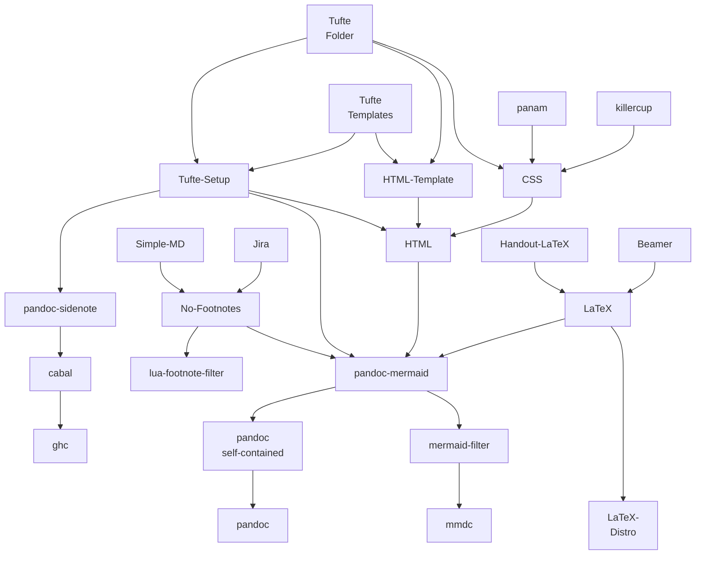

## What is this?

This is a `markdown` **example page**.
There's quite some complexities to markdown.
As a ~~programming~~ markup-language, it is mostly useful to write documents.

This graph is an approximate-example for the dependencies in my Pandoc-script.
The diagram uses [Mermaid-JS](https://mermaid.js.org/#/) which is a text base language and compiler for diagrams.



---

The code for it looks thusly:

```
flowchart
    Tufte-Complicated[Tufte<br/>Folder] ---> Tufte-Setup & CSS
    Tufte-Simple[Tufte<br/>Templates] --> Tufte-Setup & HTML-Template --> HTML
    Tufte-Complicated --> HTML-Template
    
    Simple-MD & Jira --> No-Footnotes --> pandoc-mermaid & lua-footnote-filter
    Tufte-Setup ----> pandoc-mermaid 
    Tufte-Setup ---> pandoc-sidenote
    
    pandoc-sidenote --> cabal --> ghc
    
    panam & killercup --> CSS --> HTML --> pandoc-mermaid
    
    Handout-LaTeX & Beamer --> LaTeX --> pandoc-mermaid
    LaTeX ----> LaTeX-Distribution[LaTeX-<br/>Distro]


    pandoc-mermaid --> pandoc-self-contained[pandoc<br/>self-contained] & mermaid-filter
    mermaid-filter --> mmdc
    pandoc-self-contained --> pandoc
```

## Why build this?

> “He who has a why to live for can bear almost any how.”

I build this mostly for fun.^[not really for profit, sadly.]
Some definitions:

Fun

: Something you do because it makes you feel good
: This is obviously made up.
